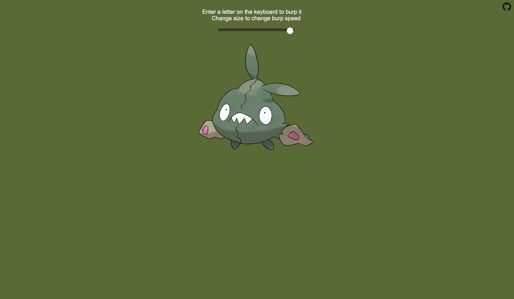

# Sir Burps-a-Lot

[Try it out!](https://sir-burps-a-lot.netlify.com/)

This is a website containing a blob which burps the letters you type. You can change the speed of its burps by changing its size.

## Installation

1. Install a version of Kotlin not less than 1.3, and less than 2, from [here](https://kotlinlang.org/docs/tutorials/command-line.html).
1. Clone the repository using one of the following methods.
    - SSH: `git clone git@github.com:neelkamath/sir-burps-a-lot.git`
    - HTTPS: `git clone https://github.com/neelkamath/sir-burps-a-lot.git`

## Usage

1. Assemble.
    - Windows: `gradle.bat assemble`
    - Other: `./gradlew assemble`
1. Run the first step again.
1. Open `web/index.html` in your browser.

## Credits

- [Alphabet Burp Dataset](https://github.com/neelkamath/alphabet-burp-dataset)
- [Kotlin JS Boilerplate](https://github.com/neelkamath/kotlin-js-boilerplate)
- [Mobile device detection SO QA](https://stackoverflow.com/questions/3514784/what-is-the-best-way-to-detect-a-mobile-device/3540295#3540295)

## License

This project is under the [MIT License](LICENSE).